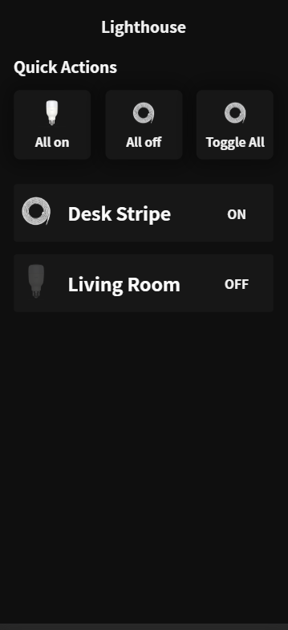

# Front-end Apllication to the Project Lighthouse application

Keep in my that this project still under development and new features will be implemented.

## Demo

  

## Installation

- Clone the repo and run `yarn` on your terminal to install the necessary dependencies
- Run `./serve.sh`, this script will start the back end server and the React Front-End server on port 3000.
