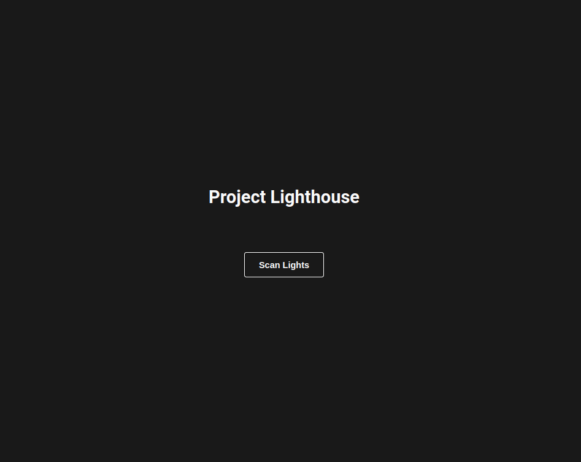

# Project Lighthouse

App to control Yeelight lights on local network.

## Demo

  

## Installation

- Clone the repo and run `yarn` on your terminal to install the necessary dependencies
- Run `yarn dev`, this script will start the back end server and the React Front-End server on port 3000.

### Oficial Docs

https://www.yeelight.com/download/Yeelight_Inter-Operation_Spec.pdf
